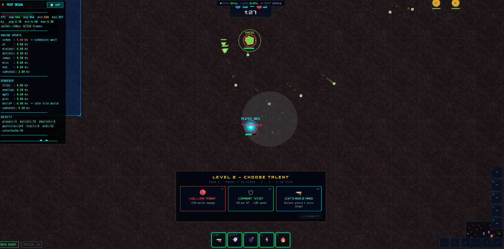
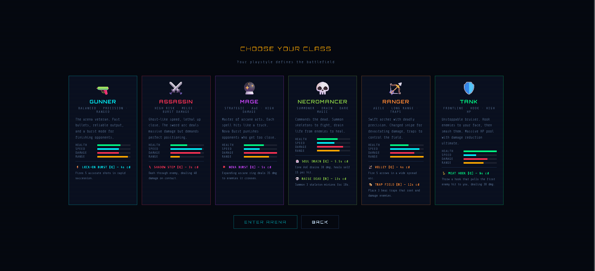
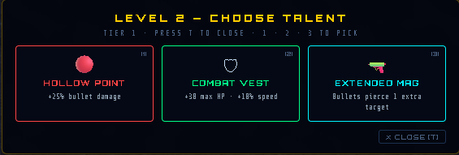
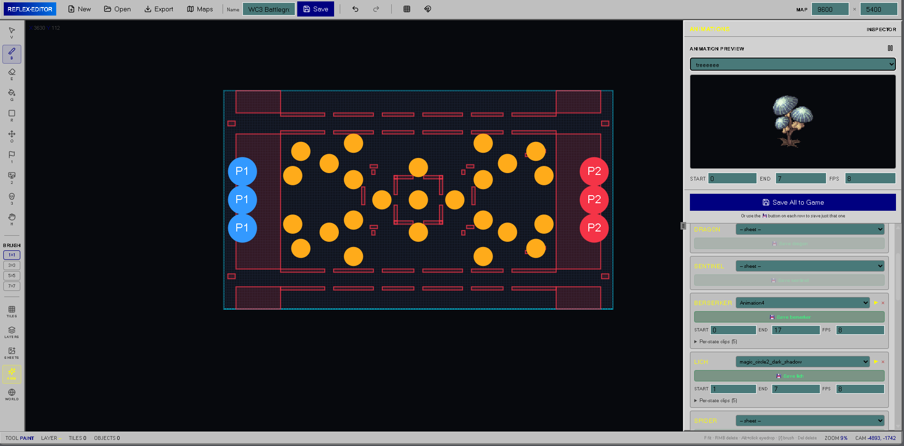

# Reflex Arena: Resource Wars

> A top-down multiplayer arena game built entirely in vanilla JavaScript and Node.js — no frameworks, no build tools, no game engine.

---

## Screenshots

<table>
  <tr>
    <td align="center"><br/><sub>In-game arena combat</sub></td>
    <td align="center"><br/><sub>Class selection screen</sub></td>
  </tr>
  <tr>
    <td align="center"><br/><sub>Non-blocking talent picker on level-up</sub></td>
    <td align="center"><br/><sub>In-browser map editor</sub></td>
  </tr>
</table>

---

## What I built

Reflex Arena is a real-time multiplayer MOBA — think early League of Legends or Warcraft 3 custom maps, running entirely in a browser tab. Players pick one of six classes, fight in a shared arena, farm jungle camps for gold and XP, level up with a talent tree, and push toward the enemy base.

The whole thing runs on a single Node.js process with no database get...(will add later), no framework, and no build step. Everything from the physics engine to the map editor to the sprite art is written from scratch in plain JavaScript.

---

## Tech stack

| Layer | What I used |
|---|---|
| Server | Node.js (ESM), `ws` for WebSockets, `multer` for file uploads |
| Renderer | PixiJS v7 (WebGL) with a Canvas 2D overlay for text and sprites |
| Language | Vanilla JavaScript — no TypeScript, no React, no bundler |
| Physics | Fixed-timestep loop at 60 Hz, runs entirely on the server |
| Networking | Binary state packets at 30 Hz, player inputs at 125 Hz |

---

## How the multiplayer works

### Why WebSockets?

The first question was what transport to use. HTTP request-response would mean the client has to constantly ask "what changed?" — that's polling, and it's wasteful and slow. WebSockets give you a persistent two-way connection where the server can push data the moment something happens, with no handshake overhead on each message. For a game running at 30 Hz that's 30 unsolicited pushes per second — impossible with regular HTTP.

### The server owns everything

The biggest architectural decision was making the server fully authoritative. Every player action — movement, shooting, buying items, using abilities — is validated server-side before anything happens. The client never trusts itself.

When you press W to move forward:

```
1. Browser sends { ax: 0, ay: -1, angle: 1.57 } to the server
2. Server runs physics, moves your character
3. Server sends updated game state back to all players
4. Screens update
```

The alternative — trusting the client — means anyone can open the browser console and set `player.x = enemyBase.x` or `player.damage = 99999`. Server authority makes that impossible because the server ignores positions it didn't calculate itself and validates every ability use against a cooldown it tracks internally.

### Why 30 Hz broadcast, not 60 Hz?

The server runs physics at 60 Hz internally but only sends state to clients every 2 ticks (30 Hz). This halves bandwidth and broadcast CPU with no perceptible difference in feel, because:

- At 30 Hz, updates arrive every ~33 ms
- The client holds a 34 ms interpolation buffer, so it always has two snapshots to blend between
- Players can't actually perceive individual network updates — they see the smooth interpolated output

Going higher than 30 Hz would cost real bandwidth and server CPU for gains the human eye can't see.

### Why 125 Hz for player input?

Input goes the other direction — from client to server. This is sent at 125 Hz (every 8 ms) because shooting and dashing happen in single frames. If input only sent at 30 Hz, a tap-fire shot could be missed entirely. 125 Hz ensures the server sees every intent, even for actions that last less than one screen frame.

### Binary protocol instead of JSON

The naive approach is to `JSON.stringify()` the game state and send that as text. The problem is size and speed:

- JSON for 6 players + 50 bullets + 18 orbs is around **4–6 KB** per update
- At 30 Hz that's **120–180 KB/sec per player**, or **720+ KB/sec total for a 6-player match**
- JSON.parse() on the client also creates many temporary objects, triggering GC

Instead the server encodes state into a raw binary `Buffer`:

```
Header   20 bytes  — tick counter, elapsed time, scores, match time limit
Players  ~60 bytes each — x/y as UInt16, hp/shield as UInt8, flags as 1 byte
Bullets  10 bytes each — x/y/vx/vy packed tight
Orbs, MobBullets, Grenades, Traps similarly packed
```

The same 6-player update is now around **400 bytes** — roughly 10× smaller. The server builds this once and calls `ws.send(buffer, { binary: true })` for each player. No per-player serialisation, no string allocation, no JSON overhead.

The flags byte is a good example of the packing approach — 8 boolean states in one byte using bitwise OR:

```js
let flags = 0;
if (p.alive)          flags |= 1;
if (p.swordOn)        flags |= 2;
if (p.novaOn)         flags |= 4;
if (p.hookOn)         flags |= 8;
if (p.barrierOn)      flags |= 16;
// etc.
```

For less-frequent data — camp mob positions, tower HP, consumable slots — plain JSON goes out every 4 broadcast ticks (~133 ms). These change slowly so the larger payload is acceptable at that rate.

### Keeping it smooth despite lag

Even on a fast connection there's always a few milliseconds of delay. Two techniques hide it:

**Local prediction** — your character moves the moment you press a key, without waiting for the server to confirm. The server's authoritative position arrives ~50 ms later. If it's close, the client blends toward it smoothly. If it's far off (packet loss, big lag spike), it hard-snaps. Only position and velocity are predicted — HP, cooldowns, and ability state are always taken from the server.

**Snapshot interpolation** — remote players and mobs are rendered from a rolling buffer of the last 10 server snapshots. Rather than jumping to each new snapshot the moment it arrives, the client renders from 34 ms in the past, always blending between two known positions. This makes movement look completely smooth even if packets arrive slightly unevenly.

The 34 ms buffer was chosen to be exactly 2 network frames (at 30 Hz = 33.3 ms per frame). Any smaller and a single late packet causes a visible stutter. Any larger and the game starts to feel sluggish.

### How matchmaking works without a database

There's no database at all. Players join a queue stored in a plain JavaScript array. When 6 players are in the queue, or 15 seconds pass with 2+ players waiting, the server calls `createMatch()`:

```js
const match = {
  id: ++matchIdCounter,
  players: [...],
  bullets: [], camps: [], orbs: [],
  score: {}, gameOver: false
};
matches.set(match.id, match);  // Map<number, match>
```

Each match is a plain object in a `Map`. When a match ends it's deleted. No Redis, no Postgres, no sessions — just memory. For a game server where matches last 5 minutes this is completely fine.

### The level and talent system

XP and levelling are fully server-authoritative for the same reason everything else is:

| Action | XP earned |
|---|---|
| Kill a player | 120 + their level × 15 |
| Pick up an orb | 12 |
| Clear a camp | 28 – 180 depending on camp type |

At levels 2, 4, 6, 8, and 10 the server sends a `levelUp` message to that player's socket only. The client shows a small panel at the bottom of the screen — **the game keeps running, nothing pauses**. When the player picks a talent, the client applies it immediately for responsiveness, then sends `{ type: 'talentPick', talentId, tier }` to the server. The server checks the talent ID against a hardcoded whitelist of all 90 valid IDs, verifies the tier is actually in that player's unlock queue, then applies the stat changes on its own authoritative copy of the player.

---

## How the renderer works

### Why PixiJS instead of a game engine

The renderer is PixiJS v7 — a WebGL 2D library, not a game engine. The distinction matters.

A full game engine (Unity, Godot, Phaser) bundles physics, audio, input handling, asset pipelines, and a scene graph. Taking all of that just for rendering means the engine is fighting the server-authoritative architecture: Phaser wants to own the physics loop and position objects itself. Since the physics runs on the server and positions arrive over the wire, any engine physics would need to be completely disabled — at which point you're carrying all that weight for nothing.

PixiJS only does one thing: draw things on screen via WebGL. That's exactly what the client needs. Everything else (input, physics sim, networking, state) is handled by hand.

### Why WebGL instead of Canvas 2D

The arena can have 6 players, ~50 bullets, 18 orbs, 25+ jungle mobs, particle effects, and a full tile map on screen at once. Canvas 2D draws each thing one at a time on the CPU — every `drawImage` is a separate call. At 60 fps with hundreds of objects, that saturates the CPU.

WebGL works differently. PixiJS batches all visible sprites into a single draw call per texture atlas, then hands the whole batch to the GPU at once. The GPU renders all 200 sprites in the same time it would take Canvas 2D to render one. On a mid-range machine the WebGL path runs at ~2.5 ms per frame, leaving over 60% of the frame budget for everything else.

### Why a Canvas 2D overlay on top of PixiJS

PixiJS handles sprites and the tile map. A second `<canvas>` element sits on top at the same size, using plain Canvas 2D. This overlay handles:

- **Sprite art** — all character and mob sprites are drawn in code via Canvas 2D calls (gradients, arcs, `fillRect`, custom shapes). Trying to do this inside PixiJS would mean creating textures from canvas on every animation frame, which is expensive. The overlay renders sprites directly, no texture round-trip.
- **Damage numbers and floating text** — short-lived, constantly changing strings. Canvas 2D `fillText` is faster here than creating and destroying PixiJS Text objects.
- **HUD overlays** — health bars over characters, cooldown rings, ability indicators.

The two layers are composited by the browser automatically — PixiJS draws the world, Canvas 2D draws UI and sprites on top, and they never touch each other's draw calls.

### Why all sprites are drawn in code

There are no image files in the project — no PNGs, no sprite sheets downloaded from a CDN. Every character and mob is drawn from scratch using `OffscreenCanvas` and Canvas 2D primitives at startup.

The reason is control and portability. Pixel art needs specific sizes for different screen scales. If you ship a 32×32 PNG and scale it up, it blurs (or requires `image-rendering: pixelated` which browsers handle inconsistently). Generating at the exact needed resolution always produces a crisp result regardless of device.

The generation runs in the background using `requestAnimationFrame`, one entity per frame. On a 60 Hz display that's about 14 frames (~233 ms) to generate all 14 entity types — invisible to the player because the title screen is showing during that time.

```js
function generateNext() {
  buildOneCharacterSheet();            // ~7 ms of canvas work per entity
  requestAnimationFrame(generateNext); // yield back to the browser between each
}
```

Once generated, each sheet is stored in a global `SPRITE_SHEETS` map and never regenerated. The animation system reads from this cache for the rest of the session.

### How animation state works

Each entity has an `angle` that the server tracks and sends in state updates. The client maps this to a sprite row:

```
Row 0–3:   idle frames (4 directions × 1 frame each in row-based mode)
Row 4–7:   walk frames
Row 8–11:  attack frames
Row 12–15: ability / special frames
Row 16:    death frame
```

The current `state` (idle / walk / attack / dead) is inferred on the client from the server data: if the player is firing, `state = 'attack'`; if velocity > 0, `state = 'walk'`; etc. This avoids sending redundant animation state over the wire.

---

## Performance problems I had to solve

JavaScript runs on a single thread. If anything takes too long in the middle of a frame, the whole game stutters. These are the main problems I ran into and how I fixed them.

---

### 1. Garbage collection spikes

JavaScript automatically frees memory that's no longer needed. The problem is that this "garbage collection" pauses execution for a few milliseconds when it runs. If you're creating thousands of small objects every second, GC fires constantly.

The original code created a fresh object every single frame for bullets, particles, and floating text:

```js
// Creates a new object 144 times per second — triggers GC constantly
bulletTrails.push({ x: b.x, y: b.y, life: 1, color: '#ff3355' });
```

**The fix: object pools.** Pre-allocate a fixed array of slots at startup. When you need a new item, find a dead slot and reuse it. No new objects, no GC pressure.

```js
function addBulletTrail(x, y, color) {
  for (let i = 0; i < bulletTrails.length; i++) {
    if (bulletTrails[i].life <= 0) {   // found a dead slot
      bulletTrails[i].x = x;
      bulletTrails[i].y = y;
      bulletTrails[i].life = 1;
      bulletTrails[i].color = color;
      return;                           // reused — zero allocation
    }
  }
}
```

I applied this to bullets, particles, damage numbers, and gold floats. After warm-up, zero objects are created per frame.

---

### 2. Slow array removal with splice

`Array.splice(i, 1)` removes an item from the middle of an array by shifting every item after it forward by one slot. On a 200-item particle array that's 200 moves per dead particle — every frame.

```js
particles.splice(i, 1);  // O(n) — shifts everything after index i
```

**The fix: swap-and-pop.** For arrays where order doesn't matter (particles, impact rings, dash trails), move the last item into the gap, then remove the end.

```js
particles[i] = particles[particles.length - 1];  // one move
particles.pop();                                   // one removal — O(1)
```

---

### 3. The game loop was wasting CPU

The original loop used a `MessageChannel` trick to fire faster than the monitor's refresh rate — sometimes 500+ times per second. Most of that work was invisible, and the loop was out of sync with the display which caused tearing.

Switching to `requestAnimationFrame` locked the loop to the monitor refresh rate. On a 144 Hz display the game now does ~2.5 ms of real work per 6.94 ms frame, leaving 64% headroom.

```js
const UNCAP_FPS = false;  // use requestAnimationFrame — vsync-locked
```

---

### 4. DOM lookups on every frame

The HUD updates 60 times per second. The original code called `document.getElementById` on every update — that's 60+ unnecessary DOM lookups per second for elements that never move.

```js
// Old — looks up the element every frame
document.getElementById('hudHPFill').style.width = hp + '%';
```

**The fix:** look up each element once at startup and store the reference.

```js
const hpFill = document.getElementById('hudHPFill');  // once

// Every frame — instant, no lookup
hpFill.style.width = hp + '%';
```

---

### 5. Server allocating objects per input

The server receives up to 750 player inputs per second (6 players × 125 Hz). Each one used to create a new object:

```js
p.input = { ax: 0, ay: -1, angle: 1.57, shoot: true };  // 750 new objects/sec
```

**The fix:** mutate the existing object instead.

```js
p.input.ax    = 0;
p.input.ay    = -1;
p.input.angle = 1.57;
p.input.shoot = true;   // zero allocations
```

---

### 6. Sprite generation blocking the screen

All character and mob art is drawn in code at startup — no image files to download. The original approach generated all 14 character sheets back-to-back, which blocked the screen for around 6 seconds.

**The fix:** generate one character per animation frame so the work spreads invisibly across 14 frames (~100 ms total).

```js
function generateNext() {
  buildOneCharacterSheet();            // ~7 ms of canvas work
  requestAnimationFrame(generateNext); // yield, let browser paint, come back
}
requestAnimationFrame(() => requestAnimationFrame(generateNext));
```

---

## The map editor

Rather than hardcoding map layouts, I built a full in-browser map editor. It runs at `/editor2/` and lets you paint walls, place jungle camps and towers, set spawn points, and position shops — all visually on a canvas.

When you're done, clicking **Deploy to Multiplayer** saves the map JSON to the server and makes it the active map. The next match loads it automatically with no server restart.

---

## Running it locally

```bash
npm install
node server.js
```

Open `http://localhost:9090` in two browser tabs and click Play in both to start a match.

---

## File overview

```
server.js              Game server — WebSocket connections, 60 Hz physics
public/
  game.html            The page players load
  js/
    engine.js          Game loop and input handling
    network.js         Connects to server, handles incoming state
    combat.js          Damage, bullets, kill logic
    renderer-pixi.js   Draws everything with WebGL (PixiJS)
    levelup.js         XP, 10-level system, 90-talent tree
    sprite-gen.js      Generates all character art in code
    hud.js             Health bar, timer, score
    ai.js              Bot and jungle mob behaviour
    map.js             Map layout and mob definitions
  maps/                Saved map files (JSON)
  screenshots/         Screenshots for this README
```

